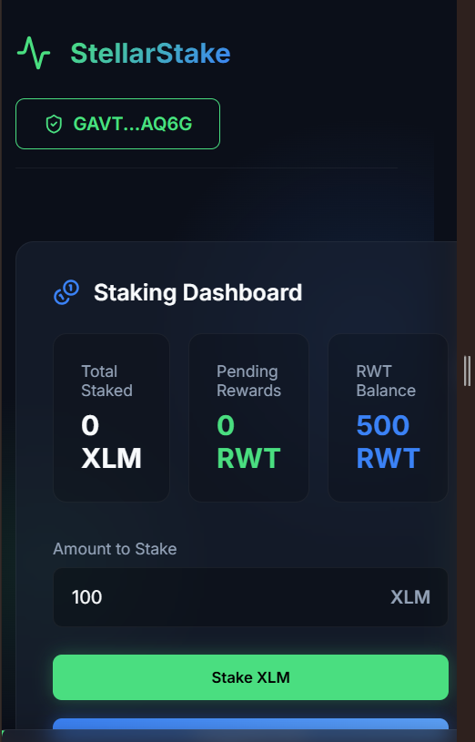
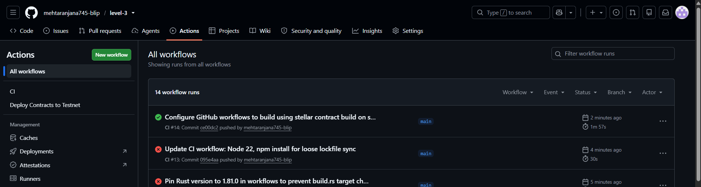
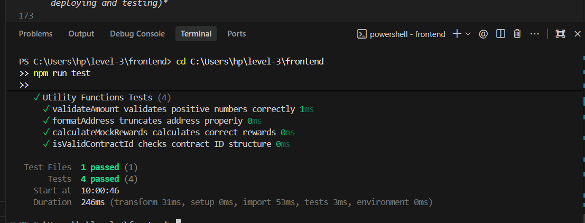
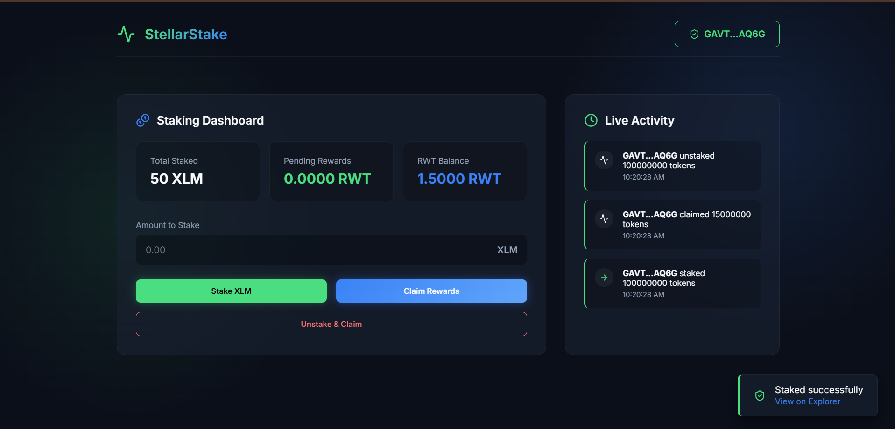

# Staking Rewards Platform

A complete, production-grade Stellar Testnet dApp utilizing Soroban smart contracts to enable native staking and automated reward token minting. 

## Overview
This platform allows users to stake assets and earn rewards over time. The backend logic is powered by two interconnected Soroban smart contracts on the Stellar Testnet:
1. **Token Contract**: A custom fungible token used as the reward asset.
2. **Staking Contract**: Handles user stakes (in XLM or other assets), calculates rewards based on the staking duration, and securely performs an **inter-contract call** to the Token Contract's `mint` function to issue rewards directly to users upon claiming.

## Features
- **Multi-wallet connection**: Support for Freighter, Albedo, and other wallets via `@creit.tech/stellar-wallets-kit`.
- **Stake / Unstake / Claim**: Core staking functionality with real-time on-chain transaction submission.
- **Inter-contract communication**: The staking contract autonomously mints rewards via the token contract.
- **Real-time Event Streaming**: Live activity feed parsing `Staked`, `Unstaked`, and `Claimed` events directly from the Soroban RPC.
- **Transaction Status Tracking**: Real-time toast notifications displaying pending/success/error states with links to `stellar.expert`.
- **Error Handling**: Graceful error handling for:
  - Wallet connection rejection
  - Invalid stake amounts (<= 0 or non-numeric)
  - Insufficient balance / Network transaction failures
- **Mobile Responsive UI**: A premium, animated interface built with Vanilla CSS and responsive grid layouts.

## Tech Stack
- **Frontend**: React (18), Vite, TypeScript, Vanilla CSS
- **Wallet Integration**: `@creit.tech/stellar-wallets-kit`, `@stellar/stellar-sdk`
- **Smart Contracts**: Soroban (Rust)
- **CI/CD**: GitHub Actions (Ubuntu-latest)
- **Network**: Stellar Testnet

## Architecture Diagram

```
[ Frontend (React/Vite) ]
       |
       | (Submits signed XDR via Soroban RPC)
       v
[ Staking Contract (Rust) ] 
       | 
       | - Records stake timestamp
       | - Calculates rewards
       |
       | (Inter-contract Call: `mint()`)
       v
[ Token Contract (Rust) ]
       |
       | - Issues newly minted tokens to user
       v
[ Stellar Testnet ]
```

The flow:
1. User connects wallet and signs a transaction to call `stake`.
2. Staking contract records the amount and timestamp.
3. User calls `claim_rewards`. Staking contract calculates time elapsed and performs an inter-contract call to the Token contract's `mint` function.
4. Token contract issues tokens to the user's address.
5. Frontend polls Soroban RPC and displays the successful event in real-time.

## Deployed Contracts
- **Token Contract ID**: `CDUPTQYFX2526AT5R3LY33DT3UFMO7ELLJ2VPFJFLQKCRILTZZKWHZ4N`
- **Staking Contract ID**: `CC7TQ56NU4YDBITTGPNIO6IPEGBEL2CABV2EC55Z3MLIY7QCXICRGGT2`
- **Explorer links format**: `https://stellar.expert/explorer/testnet/contract/<contract-id>`

## Live Demo
- `<YOUR_LIVE_DEMO_URL>` *(Replace with Vercel/Netlify URL after frontend deployment)*

## Prerequisites
- **Node.js**: v18+
- **Rust**: `stable` with `wasm32-unknown-unknown` target
- **Soroban CLI**: `cargo install --locked soroban-cli`
- **Wallet**: Freighter extension configured to Stellar Testnet

## Setup Instructions

### 1. Smart Contracts
```bash
# Build both contracts
cd contracts
rustup target add wasm32-unknown-unknown
cargo build --target wasm32-unknown-unknown --release

# Deploy Token Contract
soroban contract deploy \
  --wasm target/wasm32-unknown-unknown/release/token.wasm \
  --source admin \
  --network testnet

# Deploy Staking Contract
soroban contract deploy \
  --wasm target/wasm32-unknown-unknown/release/staking.wasm \
  --source admin \
  --network testnet

# Initialize Token Contract (replace with actual IDs)
soroban contract invoke \
  --id <TOKEN_CONTRACT_ID> \
  --source admin \
  --network testnet \
  -- \
  initialize \
  --admin <ADMIN_ADDRESS> \
  --name "RewardToken" \
  --symbol "RWT"

# Set Staking Contract as Admin of Token Contract (so it can mint)
soroban contract invoke \
  --id <TOKEN_CONTRACT_ID> \
  --source admin \
  --network testnet \
  -- \
  set_admin \
  --new_admin <STAKING_CONTRACT_ID>

# Initialize Staking Contract with Token Contract ID
soroban contract invoke \
  --id <STAKING_CONTRACT_ID> \
  --source admin \
  --network testnet \
  -- \
  initialize \
  --reward_token <TOKEN_CONTRACT_ID>
```

### 2. Frontend
```bash
cd frontend
npm install

# Create a .env file with your deployed contract IDs:
# VITE_STAKING_CONTRACT_ID=<STAKING_CONTRACT_ID>
# VITE_TOKEN_CONTRACT_ID=<TOKEN_CONTRACT_ID>

npm run dev
```

## Running Tests
To run the automated tests for both the token and staking contracts:
```bash
cd contracts
cargo test
```
*Note: The test suite includes 3+ passing tests verifying staking flows, reward calculation, and cross-contract token minting.*

## CI/CD Pipeline
This repository uses a GitHub Actions workflow (`.github/workflows/ci.yml`) to ensure code quality. On every push and PR to the `main` branch, the pipeline:
1. Installs Rust and the `wasm32-unknown-unknown` target.
2. Compiles the Token contract.
3. Runs `cargo test` for all smart contracts.
4. Installs Node.js dependencies and runs `npm run build` for the frontend.
If any tests fail or the frontend fails to build, the pipeline fails.

## How to Use the App
1. **Connect Wallet**: Click "Connect Wallet" and approve the Freighter connection.
2. **Stake Amount**: Enter an amount (e.g., `100`) and click "Stake XLM". Approve the transaction in your wallet.
3. **View Live Rewards**: Wait a few seconds; the "Pending Rewards" metric will start increasing.
4. **Claim Rewards**: Click "Claim Rewards" to mint your earned tokens to your wallet.
5. **Real-time Event Feed**: Watch the "Live Activity" panel instantly populate with your `Staked` and `Claimed` actions via Soroban RPC event polling.

## Screenshots
- 
- 
- 
- 

## Transaction Verification
- **Example Transaction Hash**: `<YOUR_TX_HASH>` *(Replace with a real tx hash after deploying and testing)*

## Demo Video
- `<YOUR_DEMO_VIDEO_LINK>` *(Replace with a link to your 1-2 min demo)*

## Project Structure
```text
.
├── contracts/
│   ├── Cargo.toml          # Workspace manifest
│   ├── staking/
│   │   ├── Cargo.toml      # Staking contract manifest
│   │   └── src/
│   │       ├── lib.rs      # Staking logic & inter-contract call
│   │       └── test.rs     # Integration tests
│   └── token/
│       ├── Cargo.toml      # Token contract manifest
│       └── src/
│           ├── lib.rs      # Token implementation (mint, transfer, balance)
│           └── test.rs     # Unit tests
├── frontend/
│   ├── package.json
│   ├── index.html
│   ├── vite.config.ts
│   └── src/
│       ├── App.tsx         # Main React application & Soroban logic
│       ├── index.css       # Premium styling & animations
│       └── main.tsx
└── .github/workflows/
    └── ci.yml              # GitHub Actions pipeline
```

## Known Limitations
- The current implementation mocks the actual transfer of native XLM into the contract for simplicity (it records the intent to stake). In a production environment, the `stake` function should include a token transfer from the user to the contract's balance using `token_client.transfer(...)`.
- Testnet data may be periodically reset by the Stellar Development Foundation.

## License
MIT License
